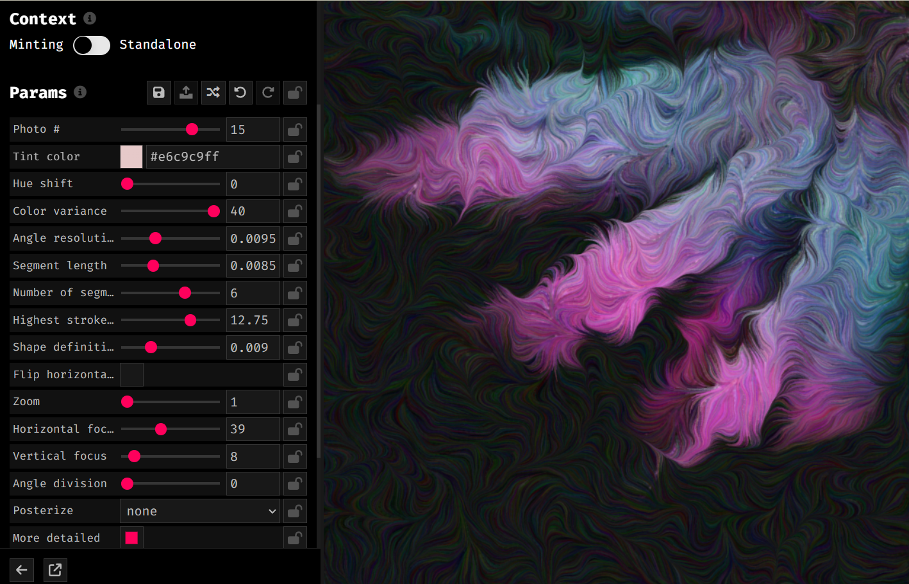

## jili0231_9103_tut3

### Research and inspiration
1. ##### Tableaux
Firstly, I thought about the artwork recreation process——Tableaux, which is the process of recreating a scene, story, historical event, artworks, with models. This idea can make artwork more interesting and amazing by changing a role or some elements of the painting.
> These are the displays of the recreated artwork.

[Recreating Famous Paintings——Website ](https://twistedsifter.com/2020/04/people-stuck-at-home-are-recreating-famous-paintings-and-its-awesome/)

2. ##### Floral Fusion
My inspiration also comes from Steve's work——Floral Fusion, and this collaboration takes Nomadic Frame’s original photos and uses Steve’s Makerspace code in p5.js to turn the photos into flow fields. As for my art work, I can turn the drawing into flow fields and then add antimations on it.
> These are the photos from Nomadic Frame.

> This is the display of Steve's work——Floral Fusion.

> [Floral-Fusion Website](https://www.fxhash.xyz/generative/slug/floral-fusion)
[Floral Fusion on fxhash -- Youtube ]( https://youtu.be/5tSgX87RwZE)

### Technical planning
1. We can recreate the artwork by changing the elements of the painting to a more interesting role or items.

2. The project can also combine with interactive parameters like color, angle, and shape adjustments to enhance the visual effect.

> This is the display of how to adjust the parameters of the artwork.

3. These are the functions and effects that can be used in my artwork recreation:
- Load images, fit to available space, and flip, zoom, and pan for fxhash params.
> [p5.js Code For A buffer Canvas](https://editor.p5js.org/StevesMakerspace/sketches/dMRN7mOSy)

- Create a static (non-animated) flow field from scratch in p5.js
> [Making a Static Flow Field YouTube](https://www.youtube.com/watch?v=R0OFyWEglGA)
[p5.js Code For A Static Flow Field](https://editor.p5js.org/StevesMakerspace/sketches/4zn-XY-FH)

- Animating the Drawing Process by interactive events
> [Animating the Drawing Process YouTube](https://www.youtube.com/watch?v=2rsqByH_ivg)
[p5.js Code For Animated art](https://editor.p5js.org/StevesMakerspace/sketches/RbULssOKQ)

